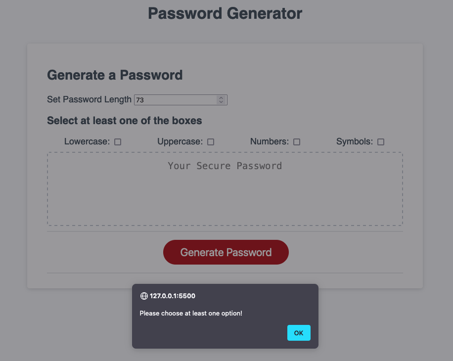

<!-- Improved compatibility of back to top link: See: https://github.com/othneildrew/Best-README-Template/pull/73 -->
<a name="readme-top"></a>
<!--
*** Thanks for checking out the Best-README-Template. If you have a suggestion
*** that would make this better, please fork the repo and create a pull request
*** or simply open an issue with the tag "enhancement".
*** Don't forget to give the project a star!
*** Thanks again! Now go create something AMAZING! :D
-->


<!-- PROJECT SHIELDS -->
<!--
*** I'm using markdown "reference style" links for readability.
*** Reference links are enclosed in brackets [ ] instead of parentheses ( ).
*** See the bottom of this document for the declaration of the reference variables
*** for contributors-url, forks-url, etc. This is an optional, concise syntax you may use.
*** https://www.markdownguide.org/basic-syntax/#reference-style-links
-->
[![Contributors][contributors-shield]][contributors-url]
[![Forks][forks-shield]][forks-url]
[![Stargazers][stars-shield]][stars-url]
[![Issues][issues-shield]][issues-url]
[![MIT License][license-shield]][license-url]
[![LinkedIn][linkedin-shield]][linkedin-url]


<!-- PROJECT LOGO -->
<br />
<div align="center">
  <a href="https://github.com/github_username/repo_name">
    
  </a>

<h3 align="center">Javascript Password Generator</h3>

  <p align="center">
   This challenge is about a Password Generator app features dynamically updated HTML and CSS, all powered by JavaScript. <br> App has to have a clean and polished user interface that is responsive, ensuring that it adapts to multiple screen sizes. <br> The password also includes special characters.
    <br />
    <br />
    <a href="https://github.com/github_username/repo_name">Repo page</a>
    ·
    <a href="https://github.com/github_username/repo_name">Deployed Application</a>
    ·
    <a href="https://github.com/github_username/repo_name/issues">Report Bug</a>
    ·
    <a href="https://github.com/github_username/repo_name/issues">Request Feature</a>
  </p>
</div>


<!-- TABLE OF CONTENTS -->
<details>
  <summary>Table of Contents</summary>
  <ol>
    <li>
      <a href="#about-the-project">About The Project</a>
      <ul>
        <li><a href="#built-with">Built With</a></li>
      </ul>
    </li>
    <li>
      <a href="#getting-started">Getting Started</a>
      <ul>
        <li><a href="#prerequisites">Prerequisites</a></li>
        <li><a href="#installation">Installation</a></li>
      </ul>
    </li>
    <li><a href="#usage">Usage</a></li>
    <li><a href="#roadmap">Roadmap</a></li>
    <li><a href="#contributing">Contributing</a></li>
    <li><a href="#license">License</a></li>
    <li><a href="#contact">Contact</a></li>
  
  </ol>
</details>


<!-- ABOUT THE PROJECT -->
## About The Project


The screenshot of the app.


<p align="right">(<a href="#readme-top">back to top</a>)</p>


### Built With

  

## Getting Started

This readme is built of an example of the "Best Readme Template" found in the wild and not the final version thereof.
https://github.com/othneildrew/Best-README-Template/blob/master/BLANK_README.md

### Prerequisites

* Generate a password when the button is clicked
  * Present a series of prompts for password criteria
    * Length of password
      * At least 8 characters but no more than 128.
    * Character types
      * Lowercase
      * Uppercase
      * Numeric
      * Special characters ($@%&*, etc)
  * Code should validate for each input and at least one character type should be selected
  * Once prompts are answered then the password should be generated and displayed in an alert or written to the page

### Installation

As the charachterset consist several data types, the best is if these treated as strings, therefore the charachterpool rewritten as here:

```
const pool = {
  upperCase: "ABCDEFGHIJKLMNOPQRSTUVWXYZ",
  lowerCase: "abcdefghijklmnopqrstuvwxyz",
  numbers: "0123456789",
  symbols: "!@#$%^&*()_+~\\`|}{[]:;?><,./-="
}
```
Special characters based on [list of Password Special Characters from the OWASP Foundation](https://www.owasp.org/index.php/Password_special_characters).

<p align="right">(<a href="#readme-top">back to top</a>)</p>


<!-- USAGE EXAMPLES -->
## Usage

The app can be used to generate a password with the length of between 8 and 128 characters.
Usage of the character options are not optional, at least one character type must be used as shown below:




Also valid for the length, that not less than 8 or more than 128 characters can be chosen:


<p align="right">(<a href="#readme-top">back to top</a>)</p>


<!-- ROADMAP -->
## Roadmap

- [ ] Password length declared
- [ ] Charachters added
- [ ] Checkboxes implemented

Future releases:
- [ ] Password length field will be changed to a slider

See the [open issues](https://github.com/github_username/repo_name/issues) for a full list of proposed features (and known issues).

<p align="right">(<a href="#readme-top">back to top</a>)</p>


<!-- CONTRIBUTING -->
## Contributing

Contributions are what make the open source community such an amazing place to learn, inspire, and create. Any contributions you make are **greatly appreciated**.

If you have a suggestion that would make this better, please fork the repo and create a pull request. You can also simply open an issue with the tag "enhancement".
Don't forget to give the project a star! Thanks again!


<p align="right">(<a href="#readme-top">back to top</a>)</p>


<!-- LICENSE -->
## License

Distributed under the MIT License.

<p align="right">(<a href="#readme-top">back to top</a>)</p>


<!-- CONTACT -->
## Contact


<p align="right">(<a href="#readme-top">back to top</a>)</p>


<!-- ACKNOWLEDGMENTS -->
## Acknowledgments

* []() In order to build the app, the internet sources has been used and altered, such as lines of code from StackoverFlow.
* []() 
* []()

<p align="right">(<a href="#readme-top">back to top</a>)</p>


---
(c) 2024 oIdioN. All rights reserved.
